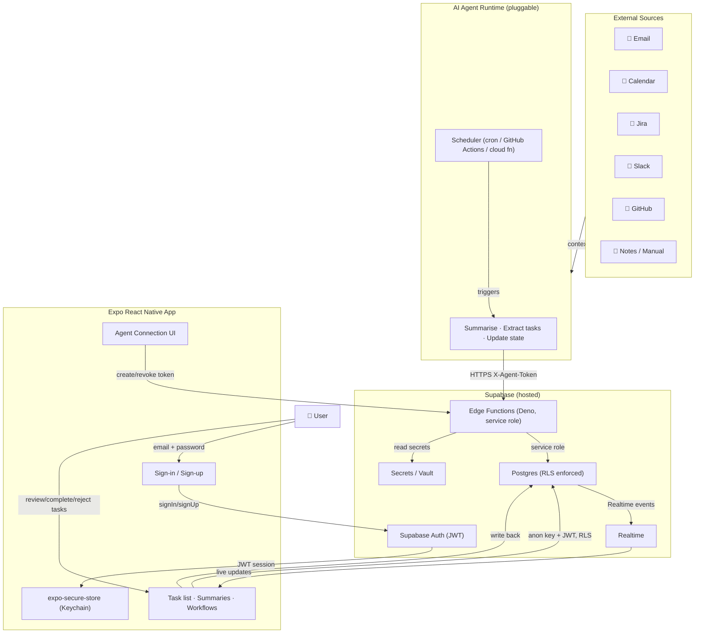

# Architecture — Daily Workflow Management App

## Overview

The Daily Workflow Management App is a three-layer system:

1. **Expo React Native mobile app** — primary UI, Expo Router navigation, hardware-backed sessions
2. **Supabase** — hosted Postgres, Auth, Row-Level Security, Edge Functions, Realtime
3. **AI Agent runtime** — pluggable; connects via authenticated Edge Functions only

The mobile app and AI agent **never connect to Postgres directly.** All agent reads/writes go through Supabase Edge Functions (which verify the agent token and derive user identity server-side). All app reads/writes go through the Supabase client (anon key + authenticated JWT, restricted by RLS).

---

## Architecture Diagram



---

## Security Principles

- **`user_id` is never trusted from the client or agent body.** The `user_id` written to any row is always derived from the authenticated Supabase session JWT (for app users) or looked up from the agent token hash (for the AI agent). Client-supplied `user_id` fields are silently ignored.
- **All queries are scoped by `user_id`.** Every RLS policy includes `auth.uid() = user_id`. A valid token for user A cannot read data belonging to user B.
- **Postgres is only reachable via Supabase's managed access paths.** The Expo app uses the anon key + authenticated JWT (bound by RLS). Edge Functions use the service role key (server-side only, bypasses RLS with explicit ownership checks).
- **No secrets in code.** The service role key exists only as a Supabase project secret injected into Edge Functions at runtime.
- **Agent tokens have explicit ownership.** Per-user connection tokens are generated in the app, stored as SHA-256 hashes, and passed as the `X-Agent-Token` header.
- **External actions require explicit user approval.** The agent may propose tasks and summaries, but no external send (email, Slack, Jira) occurs without user approval.
- **RLS is enabled on all user-owned tables.**

---

## Data Ownership Model

Every user-owned table includes:

- `id` — UUID primary key
- `user_id` — references `auth.users(id)`, NOT NULL, no DEFAULT
- `created_at` — server timestamp
- `updated_at` — updated by trigger on mutable tables

The app can only query records for the authenticated user. Supabase RLS enforces this at the database level — even if application code attempted to read another user's data, Postgres would silently filter it out.

Public open-source users self-host their own Supabase project and bring their own credentials. No shared database exists.

---

## Data Flow

```
External sources
    → Agent collects context
    → Agent reads prior workflow state (open tasks, recent summaries)
    → Agent generates summary + extracts tasks
    → Agent calls agent-write Edge Function (X-Agent-Token)
    → Edge Function verifies token, resolves user_id
    → Edge Function inserts summary + tasks + task_events into Postgres
    → Supabase Realtime notifies the mobile app
    → Mobile app refreshes task list
    → User reviews, accepts, completes, rejects tasks
    → App writes task updates + task_events back to Postgres
    → Next agent run calls agent-context Edge Function
    → Edge Function returns open tasks, recent events, completed tasks, summaries
    → Agent has full context to continue workflow
```

---

## Supabase Tables

| Table | Purpose | RLS |
|-------|---------|-----|
| `profiles` | User display name and role. Created automatically on signup. | Own row only |
| `workflows` | Named workflow definitions. | Own rows only |
| `workflow_runs` | Individual workflow execution records. | Own rows only |
| `summaries` | Text summaries created by the agent or user. | Own rows only |
| `tasks` | Core task cards. The system of record. | Own rows only |
| `task_events` | Append-only mutation log per task. One row per change. | Own rows only (append-only) |
| `agent_messages` | Structured messages the agent writes for user context. | Own rows only |
| `agent_connections` | Hashed agent tokens. Raw token never stored. | Own rows only |
| `integration_connections` | External integration links (Gmail, Slack, Jira). OAuth tokens stored in Vault. | Own rows only |
| `audit_logs` | Append-only audit trail of all agent writes and task updates. | SELECT own rows only; INSERT service role only |

---

## Task Status Flow

```
suggested → open → in_progress → done → archived
                       ↓
                   waiting (snoozed)
                       ↓
                   blocked
```

| Status | Description |
|--------|-------------|
| `suggested` | Created by agent, awaiting user review |
| `open` | Accepted by user, not yet started |
| `in_progress` | Actively being worked on |
| `waiting` | Snoozed or blocked on external input |
| `blocked` | Cannot proceed; blocker recorded |
| `done` | Completed |
| `archived` | Dismissed or no longer relevant |

---

## Edge Functions

All Edge Functions run on Supabase (Deno runtime). The service role key is injected at runtime as an environment variable and never leaves the function sandbox.

| Function | Caller | Auth method | Purpose |
|----------|--------|-------------|---------|
| `agent-context` | Agent | `X-Agent-Token` | Return current workflow context for the agent |
| `agent-write` | Agent | `X-Agent-Token` | Write summaries, tasks, and agent messages |
| `agent-update-task` | Agent | `X-Agent-Token` | Update a task and record a task_events entry |
| `create-agent-connection` | Expo app | Supabase JWT | Generate a new agent connection token |
| `revoke-agent-connection` | Expo app | Supabase JWT | Revoke an existing agent connection token |

---

## Agent Token Model

1. User generates a token: Settings → Connect Agent → New Connection.
2. App calls `create-agent-connection` Edge Function (authenticated with the user's JWT).
3. Edge Function generates a 32-byte cryptographically random token.
4. SHA-256 of the token is stored in `agent_connections.token_hash`. The raw token is never stored.
5. The raw token is returned once — the user copies it into their agent configuration.
6. On every agent request, the Edge Function hashes the incoming `X-Agent-Token` header and looks it up in `agent_connections`.
7. `user_id` is read from the database row — never from the request body.
8. Revocation sets `status = 'revoked'`, immediately invalidating all subsequent requests.

---

## Realtime

Supabase Realtime is enabled on the `tasks` and `summaries` tables. The Expo app subscribes to `postgres_changes` events. When the agent inserts a task via `agent-write`, the Realtime event fires and the app refreshes automatically — no polling required.

---

## Drawbacks and Limitations

- **The agent can hallucinate or create low-quality tasks.** AI-generated tasks should always be reviewed by the user before acting on them.
- **The app does not run the agent.** The mobile app is a UI for reviewing and acting on tasks. The agent is a separate runtime that must be configured and scheduled separately.
- **Expo Go is for development and testing, not production.** For production distribution, use EAS Build, TestFlight for iOS, or app store deployment.
- **Persistent scheduled automation requires an external scheduler.** If your local computer stops, the local Expo dev server and any local agent processes stop too. Cloud functions, cron jobs, GitHub Actions, or hosted agents are required for persistent automation.
- **The agent needs secure access to external tools.** Integrations like Gmail, Jira, Slack, and GitHub require each user to configure their own credentials.
- **Data privacy depends on correct RLS, safe credential handling, and careful agent permissions.** Review `docs/SECURITY.md` before any production use.
- **This is not a replacement for secure enterprise workflow tools** without proper review, testing, and hardening.
- **This is an MVP/foundation, not a fully managed SaaS product.**

---

## Alternative Architecture (Future)

The `backend/` directory contains a legacy AWS Lambda + MongoDB Atlas implementation. It is preserved as a reference and is not the active path. If scale requirements grow beyond Supabase's limits, migrating the Edge Functions to AWS Lambda and the database to MongoDB Atlas or Aurora Postgres is a viable path.
